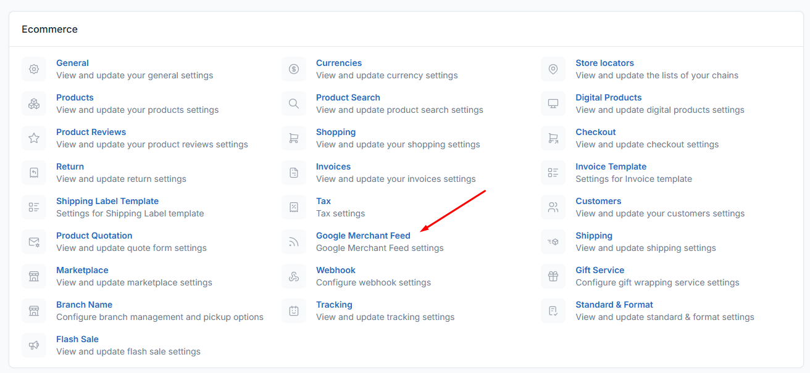

# Google Merchant Feed Plugin for Botble CMS


A powerful and easy-to-use plugin that automatically generates Google Shopping XML feeds for your Botble E-commerce store. Seamlessly integrate your product catalog with Google Merchant Center to boost your online visibility and drive more sales through Google Shopping ads.

## 📋 Description

The **Shaqi Google Merchant Feed** plugin creates a fully compliant XML feed that includes all your products with essential information required by Google Merchant Center. This plugin automatically formats your product data according to Google Shopping specifications, making it simple to list your products on Google Shopping without manual data entry.

## ✨ Features

### Core Features
- **Automatic XML Feed Generation** - Generates Google Shopping compliant XML feed automatically
- **Real-time Product Sync** - Always displays up-to-date product information from your store
- **Comprehensive Product Data** - Includes product title, description, price, sale price, brand, categories, images, and availability
- **Easy Enable/Disable** - Simple toggle to enable or disable the feed generation
- **SEO-Friendly URLs** - Clean and accessible feed URL for Google Merchant Center
- **Multi-Category Support** - Automatically maps product categories to Google product types
- **Brand Integration** - Includes product brand information in the feed
- **Stock Status Tracking** - Displays real-time product availability status
- **Sale Price Support** - Automatically includes sale prices when products are on discount
- **Currency Support** - Uses your store's configured currency for pricing
- **Image Integration** - Automatically includes product images in the feed
- **Admin Settings Panel** - User-friendly settings interface in the admin dashboard
- **No External Dependencies** - Works entirely within your Botble installation

### 🛡️ Reliability & Error Handling (New in v1.1.0)
- **Comprehensive Error Handling** - Robust error handling prevents feed generation failures
- **Graceful Degradation** - Continues processing even if individual products have issues
- **Smart Fallbacks** - Automatic fallbacks for missing data (images, descriptions, brands, etc.)
- **Production-Ready** - Thoroughly tested error scenarios and edge cases
- **Detailed Logging** - Comprehensive error logging for easy troubleshooting
- **Data Validation** - Validates all required fields before processing

### ⚡ Performance & Optimization (New in v1.1.0)
- **Eager Loading** - Optimized database queries with relationship eager loading
- **N+1 Prevention** - Eliminates N+1 query problems for better performance
- **Efficient Processing** - Optimized feed generation for large product catalogs
- **Memory Efficient** - Handles large product sets without memory issues

### 🔒 Security & Data Integrity (New in v1.1.0)
- **XML Injection Protection** - Protected against XML injection attacks
- **Proper Data Escaping** - All data properly escaped for XML compliance
- **UTF-8 Encoding** - Full UTF-8 support for international characters
- **Safe Error Messages** - Error messages don't expose sensitive information

## 📦 Requirements

- **Botble CMS**: Version 7.0 or higher
- **PHP**: Version 8.1 or higher
- **Required Plugins**: 
  - Botble E-commerce plugin (must be installed and activated)
- **Server Requirements**:
  - SimpleXML PHP extension
  - XML support enabled

## 🚀 Installation

### Method 1: Manual Installation

1. Download the plugin package
2. Extract the `google-merchant-feed` folder
3. Upload the folder to `platform/plugins/` directory
4. Navigate to **Admin Panel → Plugins**
5. Find "Google Merchant Feed" in the plugin list
6. Click **Activate** to enable the plugin


Then activate the plugin from the admin panel.

## ⚙️ Configuration

### Step 1: Activate the Plugin

1. Log in to your Botble admin panel
2. Navigate to **Plugins** from the sidebar
3. Locate **Google Merchant Feed** in the plugin list
4. Click the **Activate** button

### Step 2: Configure Settings

1. Go to **Settings → Google Merchant Feed** in the admin panel
2. Toggle **Enable Google Merchant Feed** to ON
3. Copy the generated feed URL displayed on the settings page
4. Click **Save Settings**

### Step 3: Submit to Google Merchant Center

1. Log in to your [Google Merchant Center](https://merchants.google.com/) account
2. Navigate to **Products → Feeds**
3. Click **Add Feed** (or the + button)
4. Select your country and language
5. Name your feed (e.g., "My Store Product Feed")
6. Choose **Scheduled fetch** as the input method
7. Paste your feed URL: `https://yourdomain.com/google-shopping/xml-feed`
8. Set the fetch frequency (recommended: daily)
9. Click **Create Feed**

## 📖 Usage Guide

### Accessing Your Feed

Once enabled, your Google Shopping XML feed will be automatically available at:

```
https://yourdomain.com/google-shopping/xml-feed
```

### Feed Content

The plugin automatically includes the following product information:

- **Product ID** - Unique identifier for each product
- **Title** - Product name
- **Description** - Product description
- **Link** - Direct URL to the product page
- **Image Link** - Main product image URL
- **Price** - Regular product price with currency
- **Sale Price** - Discounted price (if applicable)
- **Brand** - Product brand name
- **Product Type** - Category hierarchy
- **Condition** - Always set to "new"
- **Availability** - Current stock status (in stock, out of stock, etc.)

### Managing the Feed

- **Enable/Disable**: Toggle the feed on or off from the settings page
- **Automatic Updates**: The feed updates automatically when you add, edit, or remove products
- **No Manual Refresh**: Google Merchant Center will fetch updates based on your configured schedule

## 📸 Screenshots


*Google Merchant Feed settings panel in the admin dashboard*

## 🔧 Troubleshooting

### Feed Not Accessible

- Ensure the plugin is activated
- Verify that "Enable Google Merchant Feed" is toggled ON in settings
- Check that the E-commerce plugin is installed and activated
- Clear your application cache

### Products Not Showing in Feed

- Verify that products are published and visible
- Check that products have all required fields (name, price, image)
- Ensure products are in stock or have a valid stock status

### Google Merchant Center Errors

- Validate your feed URL is accessible publicly
- Ensure product images are publicly accessible
- Check that all required product attributes are present
- Review Google Merchant Center's diagnostic reports for specific issues

## 💡 Best Practices

1. **Complete Product Information** - Ensure all products have descriptions, images, and prices
2. **Accurate Stock Status** - Keep inventory updated for accurate availability
3. **Quality Images** - Use high-quality product images (minimum 800x800px recommended)
4. **Detailed Descriptions** - Provide comprehensive product descriptions
5. **Regular Monitoring** - Check Google Merchant Center regularly for feed status and errors
6. **Brand Information** - Add brand information to all products for better categorization

## 📞 Support & Contact

For support, bug reports, or feature requests:

- **Author**: Ishtiaq Ahmed
- **Profile**: [Upwork Profile](https://www.upwork.com/freelancers/~013d0214b96ae5f4a3)
- **Email**: Contact through Upwork profile
- **Issues**: Report issues with detailed information about your environment and the problem

## 📄 License

This plugin is licensed under the **MIT License**.

```
MIT License

Copyright (c) 2024 Ishtiaq Ahmed (Shaqi)

Permission is hereby granted, free of charge, to any person obtaining a copy
of this software and associated documentation files (the "Software"), to deal
in the Software without restriction, including without limitation the rights
to use, copy, modify, merge, publish, distribute, sublicense, and/or sell
copies of the Software, and to permit persons to whom the Software is
furnished to do so, subject to the following conditions:

The above copyright notice and this permission notice shall be included in all
copies or substantial portions of the Software.

THE SOFTWARE IS PROVIDED "AS IS", WITHOUT WARRANTY OF ANY KIND, EXPRESS OR
IMPLIED, INCLUDING BUT NOT LIMITED TO THE WARRANTIES OF MERCHANTABILITY,
FITNESS FOR A PARTICULAR PURPOSE AND NONINFRINGEMENT. IN NO EVENT SHALL THE
AUTHORS OR COPYRIGHT HOLDERS BE LIABLE FOR ANY CLAIM, DAMAGES OR OTHER
LIABILITY, WHETHER IN AN ACTION OF CONTRACT, TORT OR OTHERWISE, ARISING FROM,
OUT OF OR IN CONNECTION WITH THE SOFTWARE OR THE USE OR OTHER DEALINGS IN THE
SOFTWARE.
```

## 📝 Changelog

### Version 1.1.0 (2025-11-19) - Major Stability Update

#### 🛡️ Error Handling & Reliability
- ✅ **Comprehensive Error Handling** - Added try-catch blocks throughout feed generation
- ✅ **Graceful Degradation** - Feed continues processing even if individual products fail
- ✅ **Currency Validation** - Validates application currency is configured before generation
- ✅ **XML Generation Safety** - Protected XML initialization and output with error handling
- ✅ **Product Validation** - Validates required product fields before adding to feed
- ✅ **Relationship Validation** - Checks brand and category relationships exist before accessing

#### 🚀 Performance Improvements
- ✅ **Eager Loading** - Added eager loading for product relationships (slugable, brand, categories)
- ✅ **N+1 Query Prevention** - Eliminated N+1 query problem for better performance
- ✅ **Optimized Database Queries** - More efficient product data retrieval

#### 🔒 Security & Data Integrity
- ✅ **Enhanced XML Escaping** - Improved XML special character handling with ENT_XML1 | ENT_QUOTES
- ✅ **UTF-8 Encoding** - Proper UTF-8 encoding in XML declaration and headers
- ✅ **XML Injection Prevention** - Protected against XML injection attacks
- ✅ **Safe Data Output** - All user data properly escaped before output

#### 🎯 Robust Fallback Mechanisms
- ✅ **Product URL Fallback** - Falls back to homepage if product URL generation fails
- ✅ **Brand Fallback** - Uses "Unknown" if brand is missing or deleted
- ✅ **Description Fallback** - Uses product name if description is empty
- ✅ **Image Fallback** - Uses default image if product image is missing
- ✅ **Category Handling** - Gracefully handles products without categories
- ✅ **Empty Store Handling** - Returns valid empty feed when no products exist

#### 📊 Logging & Debugging
- ✅ **Comprehensive Logging** - Added detailed error logging at appropriate levels
- ✅ **Context Information** - Logs include product IDs and error details for debugging
- ✅ **Production-Safe** - Error messages don't expose sensitive information to users
- ✅ **Debug Support** - Detailed logs help troubleshoot production issues

#### 🏗️ Code Quality Improvements
- ✅ **Modular Architecture** - Separated concerns into dedicated helper methods
- ✅ **PHPDoc Comments** - Added comprehensive documentation for all methods
- ✅ **Code Readability** - Improved code organization and structure
- ✅ **Best Practices** - Follows Laravel and Botble coding standards

#### 🔧 Bug Fixes
- 🐛 **Fixed** - Null pointer exception when accessing brand name on deleted brands
- 🐛 **Fixed** - Null pointer exception when product URL cannot be generated
- 🐛 **Fixed** - Error when product description is null or empty
- 🐛 **Fixed** - Error when product has no image
- 🐛 **Fixed** - Error when product has no categories
- 🐛 **Fixed** - Error when currency is not configured
- 🐛 **Fixed** - Silent failures during XML generation
- 🐛 **Fixed** - Special characters breaking XML structure

#### 📋 New Helper Methods
- `addProductToFeed()` - Safely adds a single product to the feed
- `getProductUrl()` - Gets product URL with fallback to homepage
- `getBrandName()` - Gets brand name with fallback to "Unknown"
- `getProductType()` - Gets product categories with error handling
- `getProductImageUrl()` - Gets image URL with fallback to default
- `escapeXml()` - Properly escapes XML content with correct flags

#### 🎯 HTTP Response Improvements
- ✅ **Proper Status Codes** - Returns appropriate HTTP status codes (404, 500)
- ✅ **Content-Type Headers** - Correct content-type headers for all responses
- ✅ **User-Friendly Messages** - Clear error messages for troubleshooting
- ✅ **UTF-8 Response Headers** - Proper encoding in response headers

---

### Version 1.0.0 (2024-11-15) - Initial Release

#### 🎉 Core Features
- ✅ Initial release
- ✅ Automatic Google Shopping XML feed generation
- ✅ Admin settings panel with enable/disable toggle
- ✅ Support for product prices, sale prices, and currency
- ✅ Brand and category integration
- ✅ Stock status tracking
- ✅ Image URL integration
- ✅ Real-time product synchronization
- ✅ Clean and SEO-friendly feed URL

#### 📦 Product Data Support
- ✅ Product ID, title, description
- ✅ Product links and image links
- ✅ Regular and sale prices
- ✅ Brand information
- ✅ Product categories (product_type)
- ✅ Stock availability status
- ✅ Product condition (new)

#### ⚙️ Configuration
- ✅ Simple enable/disable toggle
- ✅ Settings panel in admin dashboard
- ✅ Feed URL display in settings
- ✅ Integration with Botble E-commerce

---

## 🌟 Why Choose This Plugin?

- **Easy Setup** - Get your Google Shopping feed running in minutes
- **Automatic Updates** - No manual feed management required
- **Botble Native** - Built specifically for Botble CMS with best practices
- **Lightweight** - Minimal impact on site performance
- **Standards Compliant** - Follows Google Shopping feed specifications
- **Professional Support** - Backed by experienced Botble developer

---

**Made with ❤️ by Ishtiaq Ahmed for the Botble Community**

